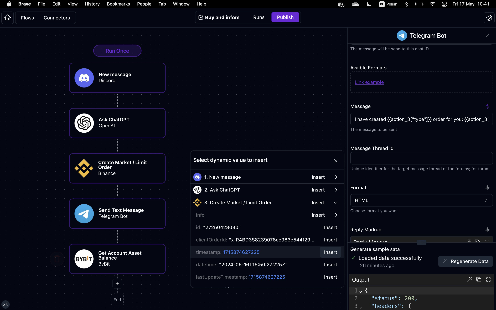
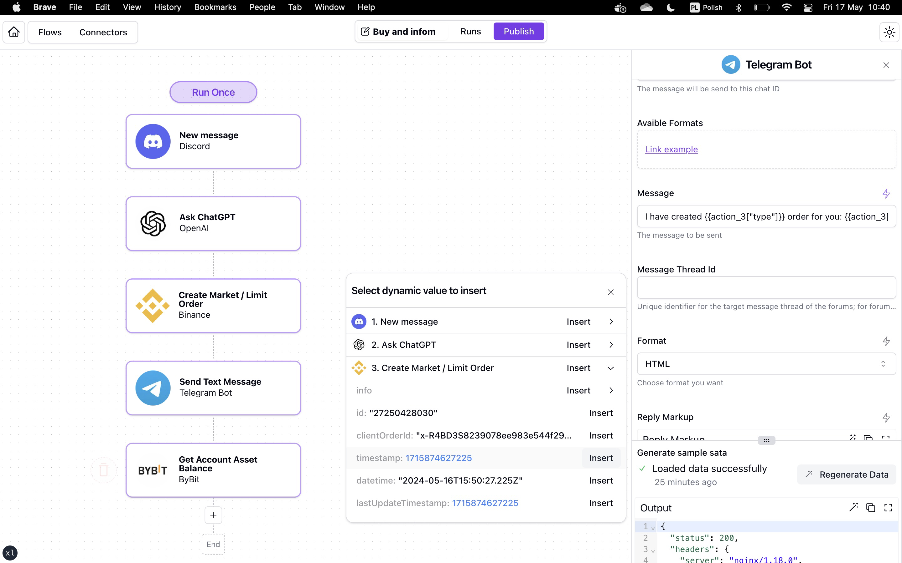
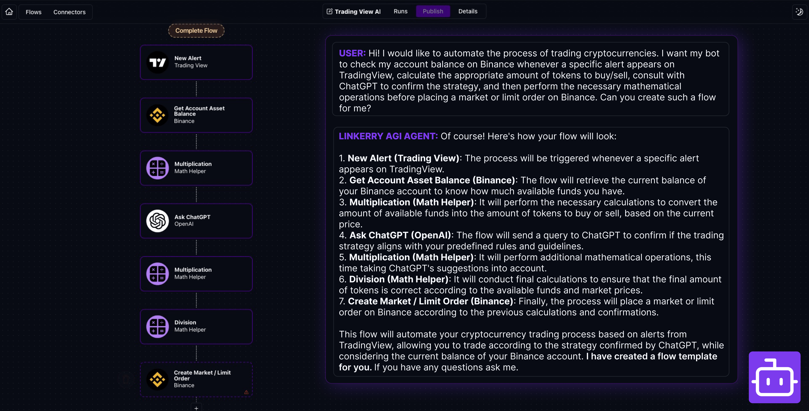
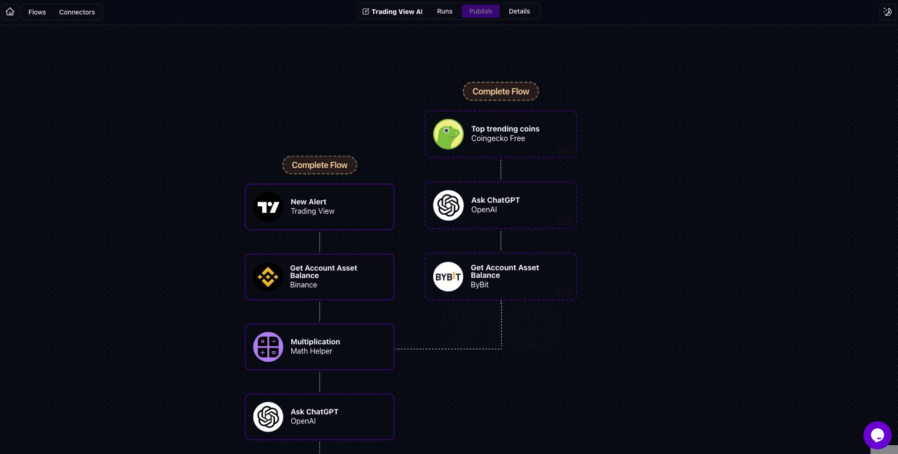
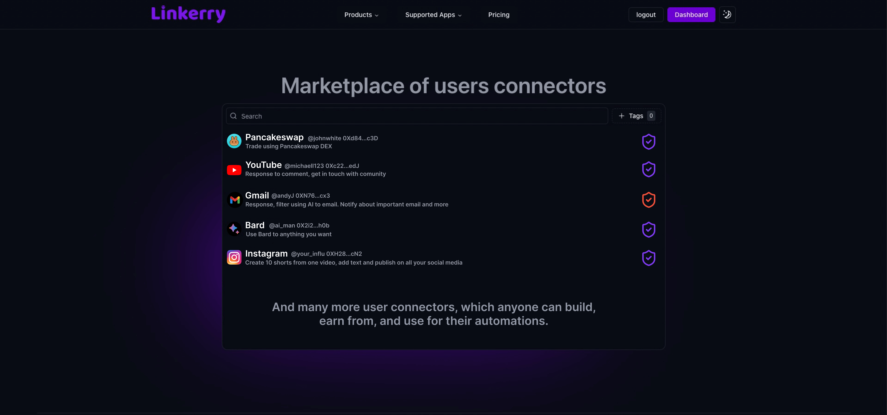

# Linkerry - Automated Process Integration and AI-Driven Platform

## Table of Contents

- [Introduction](#introduction)
- [Architecture](#architecture)
- [Key Features](#key-features)
- [Technologies](#technologies)
- [Images and Video](#images-and-video)

## Introduction

Linkerry is an advanced automation platform designed to connect and integrate various applications seamlessly, with a strong emphasis on AI-powered tools, web3 applications (blockchain and decentralization), and other popular corporate tools like excel, email etc.. The platform enables users to create and manage process automation across these applications, simplifying workflows and enhancing productivity.

## Architecture

Apps are in the `apps` dir. They use their libraries to have an easier maintenance process and easily introduce changes in one place, in those libraries. Libs are in the `libs` dir. The main libs are ReactJS components which use TailwindCSS, Shadncn, and Radix for headless logic, NestJS libs with modules based on the app domain, and shared helpers/types lib.

Linkerry's architecture is designed to ensure flexibility, scalability, and ease of integration:

- **NX Monorepo:** The entire project is organized as a monorepo, managed with the NX tool, facilitating modular development and deployment. There are also some bash scripts to automate daily tasks.

- **Backend:** The backend is powered by NestJS, with Redis for caching and shared resource management. Behind the scene, it uses private NestJS package with custom modules for app domain.

- **Automation Engine:** Built in pure TypeScript, the automation engine allows for dynamic execution of tasks within secure sandbox environments. It is designed to have the best performance as it can.

- **Frontend:** The frontend is developed using NextJS (version 14) with own React components library which uses TailwindCSS. There are also state management handled by Zustand and React contexts.

- **Database:** MongoDB serves as the primary database, ensuring scalable and flexible data management.

- **CI/CD Pipeline:** Automated deployment processes are handled by GitHub Actions, ensuring smooth updates and version control across environments.

## Key Features

Linkerry offers a range of key features:

- **Application Automations:** Effortlessly connect and automate processes across multiple applications, including AI tools, blockchain, and popular enterprise applications.

- **Visual Automation Editor:** Design and manage automation visually with a powerful editor built using the ReactFlow library.

- **Modular NPM Architecture:** Each integration is built as a separate npm package, allowing for easy updates without disrupting existing automations.

- **Advanced Automation Engine:** The backend features a robust automation engine written in pure TypeScript, enabling execution in either a cached or new sandbox environment to speed up performance.

- **Scalable Backend:** Built on NestJS, the backend leverages Redis for caching, request limiting, and resource locking, ensuring efficiency and reliability.

- **AGI helper:** Use AI AGI agent to find sollution for tsk automation and they will create flow schema for You.

## Technologies

 
 

- **Frontend:** Developed with ReactJS (NextJS 14), using TypeScript and Zustand for state management.

- **Backend:** Powered by NestJS, with Redis for efficient resource management and MongoDB as the primary database.

- **Automation Engine:** Built with pure TypeScript to execute tasks in dynamic sandbox environments.

- **Visual Editor:** Utilizes the ReactFlow library for a comprehensive visual process editor.

- **CI/CD Pipeline:** Managed via GitHub Actions for streamlined and automated deployments. The CI also use Docker to maintain app versions and have better developer experience during deployment. Process is full automated.

## Images and Video

### Overview Video

**Linkerry Overview Video (PL language)**

      

### Screenshots

---
