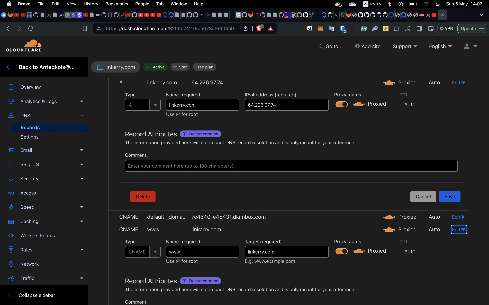
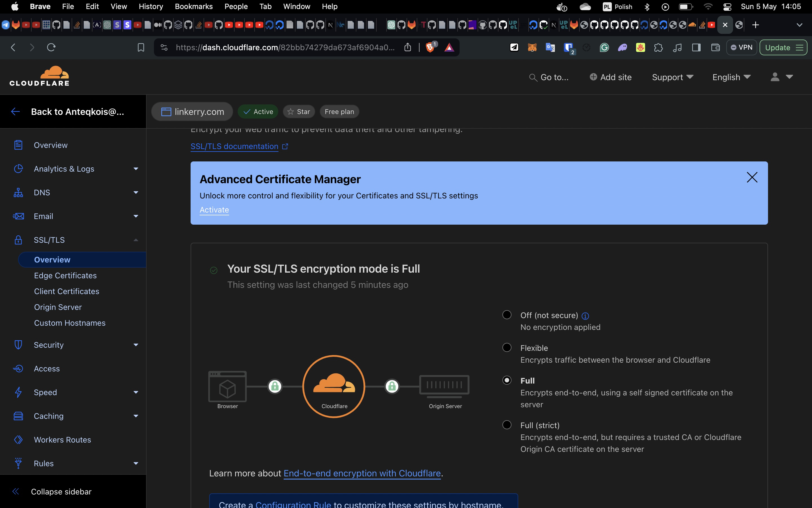

## Install and start proxy docker 

Setup proxy
`git clone --recurse-submodules https://github.com/evertramos/nginx-proxy-automation.git proxy`
`cd proxy/bin && ./fresh-start.sh --yes --skip-docker-image-check -e anteqkois@gmail.com`
test
`./test.sh api.linkerry.com`

Not it will display default proxy page 'It works'

## For website add two DNS

## If you use Cloudflare, change SSL settings

## For subdomains add this page rules

